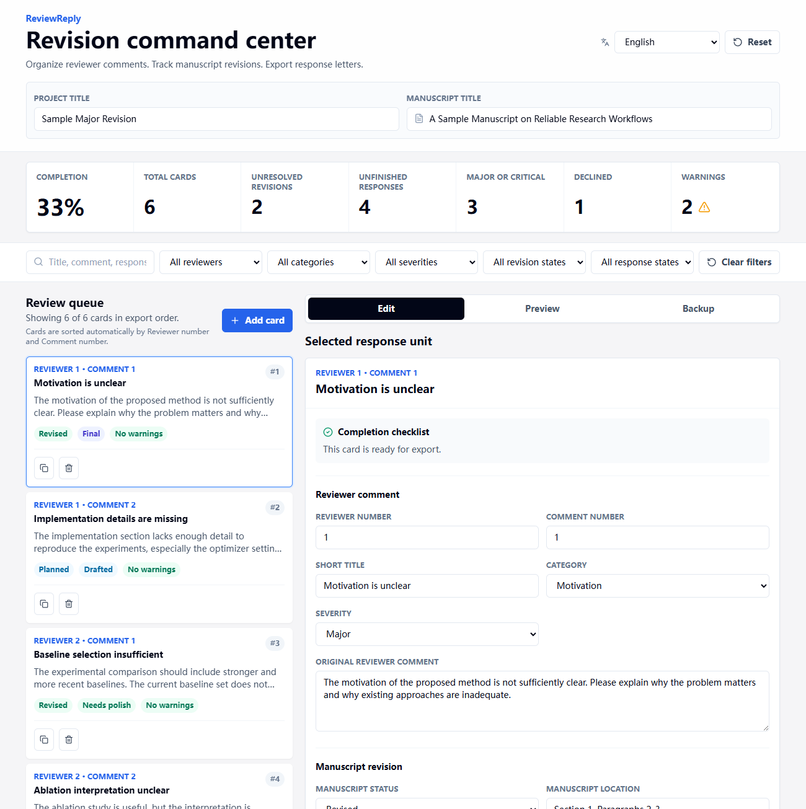
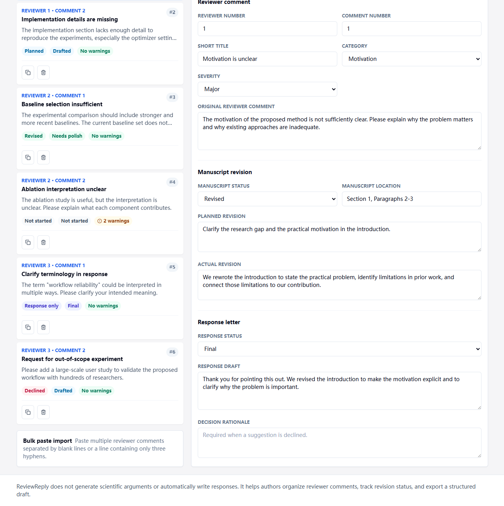

# ReviewReply

A local-first reviewer-comment workspace for tracking manuscript revisions and exporting structured response letters.

ReviewReply is a small static web app for authors who need to organize reviewer comments during rebuttal, minor revision, or major revision. It keeps every comment as a response unit, tracks manuscript changes separately from response drafting, and exports an English Markdown response letter.

<p align="center">
  
  
</p>

## Highlights

- Local-first: all project data is stored in the browser with `localStorage`.
- Static deployment: no backend, database, authentication, or API key.
- English and Simplified Chinese interface, with English as the default.
- Response letters are always exported in English for journal and conference submission.
- Automatic export ordering by reviewer number and comment number.
- Focused editor for reviewer comment, manuscript revision, and response draft.
- Dashboard metrics for completion, unresolved revisions, unfinished responses, declined items, and warnings.
- Search and filters by reviewer, category, severity, manuscript status, and response status.
- Bulk paste import for multiple reviewer comments.
- JSON backup and restore for moving projects between browsers or devices.

## Quick Start

```bash
npm install
npm run dev
```

Build the production app:

```bash
npm run build
```

Preview the production build:

```bash
npm run preview
```

The production output is written to `generated/dist/`.

## GitHub Pages

This repository includes a GitHub Actions workflow for GitHub Pages:

```text
.github/workflows/deploy.yml
```

To deploy:

1. Push the repository to GitHub.
2. Open repository **Settings** -> **Pages**.
3. Set **Build and deployment** -> **Source** to **GitHub Actions**.
4. Push to the `main` branch.
5. The workflow runs `npm ci`, builds the app, uploads `generated/dist`, and publishes it to GitHub Pages.

The Vite base path is relative, so the app works under a GitHub Pages project URL.

## Project Structure

```text
.github/workflows/
  deploy.yml
docs/
  reviewreply1.png
  reviewreply2.png
generated/
  .gitkeep
src/
  App.tsx
  components.tsx
  core.ts
  i18n.ts
  index.css
  main.tsx
index.html
package.json
package-lock.json
postcss.config.js
tailwind.config.js
tsconfig*.json
vite.config.ts
```

The source tree is intentionally compact:

- `src/App.tsx`: application state, first-run flow, layout, and event handlers.
- `src/components.tsx`: reusable UI sections for the header, dashboard, filters, queue, editor, backup, preview, and language switcher.
- `src/core.ts`: project types, sample data, sorting, filtering, warnings, Markdown generation, JSON validation, and localStorage helpers.
- `src/i18n.ts`: English and Simplified Chinese interface text.
- `src/index.css`: Tailwind layers and shared utility classes.
- `generated/`: ignored local output folder for build artifacts, npm cache, logs, and TypeScript build metadata.

## Data and Privacy

ReviewReply stores data only in the current browser unless you export a JSON backup. Browser data can be lost if site data is cleared, a different browser is used, or a device is replaced.

Export JSON regularly for important revision projects.

## Non-Goals

ReviewReply does not generate scientific arguments, automatically write rebuttals, parse PDF or Word files, compile LaTeX, sync to the cloud, create user accounts, or save directly to GitHub.

## License

MIT

---

# ReviewReply 中文说明

ReviewReply 是一个本地优先的审稿意见整理工具，用来帮助作者管理返修、rebuttal、minor revision 或 major revision 过程中的 reviewer comments，并导出结构化的英文回复信草稿。

它是一个纯静态网页应用，不需要后端、数据库、登录系统或 API key。项目数据默认保存在当前浏览器的 `localStorage` 中，只有在你主动导出 JSON 时才会离开浏览器。

## 主要特点

- 本地优先：项目数据保存在浏览器本地。
- 易部署：可以直接部署到 GitHub Pages。
- 界面支持英文和简体中文，默认英文。
- 回复信正文固定导出为英文，适合期刊或会议提交。
- 按 Reviewer 编号和 Comment 编号自动排序。
- 每条审稿意见独立成卡片，便于逐条处理。
- 分开记录 manuscript revision 和 response draft。
- 仪表盘显示完成度、未完成修改、未完成回复、拒绝建议和提醒数量。
- 支持按 reviewer、类别、严重程度、修改状态和回复状态筛选。
- 支持批量粘贴导入审稿意见。
- 支持 JSON 备份和恢复，方便迁移到其他浏览器或设备。

## 本地运行

```bash
npm install
npm run dev
```

构建生产版本：

```bash
npm run build
```

预览生产版本：

```bash
npm run preview
```

构建产物会输出到 `generated/dist/`。

## 部署到 GitHub Pages

项目已经内置 GitHub Actions 部署流程：

```text
.github/workflows/deploy.yml
```

部署步骤：

1. 把项目推送到 GitHub。
2. 打开仓库 **Settings** -> **Pages**。
3. 将 **Build and deployment** -> **Source** 设置为 **GitHub Actions**。
4. 推送到 `main` 分支。
5. GitHub Actions 会自动运行 `npm ci`、`npm run build`，上传 `generated/dist` 并部署。

## 文件结构

```text
src/
  App.tsx          # 应用状态、布局和主要交互
  components.tsx   # 页面组件
  core.ts          # 数据类型、示例数据、排序筛选、导入导出、Markdown 和本地存储
  i18n.ts          # 中英文界面文案
  index.css        # Tailwind 和通用样式
  main.tsx         # React 入口
docs/              # README 截图
generated/         # 构建产物和本地缓存，仅保留 .gitkeep
```

这个项目刻意保持紧凑结构。对于当前体量来说，少量清晰文件比过度拆分更容易维护、阅读和发布。

## 数据安全

ReviewReply 不会自动上传你的审稿意见或回复内容。数据只保存在当前浏览器中，但如果清理浏览器数据、更换浏览器或更换设备，数据可能丢失。

重要项目请定期使用 **Export JSON** 备份。

## 许可证

MIT
